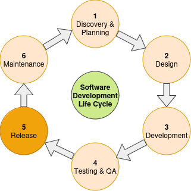

# Software Releases

## Introdution

Developing software is an iterative process which also involves the creation software releases at particular points in time.
In a software development life cycle this phase is located between testing & quality assurance and maintenance (see diagram below).

Releasing a software means to create a snapshot of the current state of of your software and assigning a version to that snapshot.
It is recommended to use [Semantic Versioning](https://semver.org/) as the versioning schema for the version strings.
Semantic Versioning makes sure that users of your software understand the impact of your released software.
Depending on whether it is a major, minor or patch release users can assess how severe the changes are when moving from one version to another.

## Authors and Copyright

Within this snapshot the authors and copyright holders of the files included need to be given.
Giving credit to all contributors involved is also a good habit.
It is a good practice to have a copyright statement in each of the files included.
Tools like [REUSE](https://reuse.software/) can be used to check this.

## Licenses

A license manages the rights of the copyright holders and the users of the software.
If no license is given all rights are reserved by the copyright holders and no rights are granted to others.
It is recommended to release your software as open source software.
In brief, for open source software rights like usage, modifications and distribution are granted to the users of your software.
This involves choosing an appropriate open source software license from the list of [OSI approved licenses](https://opensource.org/licenses) beforehand.
Each file in the release needs to have a license statement which can be verified by tools like [REUSE](https://reuse.software/).
On top, the repository should include a file like `License.md` that contains the license text of the license used.

## Citations

You might also want to provide a file in the [Citation File Format (CFF)](https://citation-file-format.github.io/) like `CITATION.cff` to give citation information about your software and make sure that other can cite your software releases properly.

## Changelog

Semantic Versioning gives you a rough idea about the impact the release might have and the severity of changes when moving from one version to another.
Nonetheless, it is inevitable to provide a standarised [Changelog](https://keepachangelog.com/en/1.1.0/) to users that explains in detail which changes where applied to a particular release.
You can generated Changelogs from your commit messages with Changelog Generators like [git-cliff](https://www.conventionalcommits.org/en/v1.0.0/).
Commit messages need to follow specific conventions.
Writing good commit messages is essential for users to know what has been changed and why.
It is recommended to follow common advice about writing [good commit messages](https://www.freecodecamp.org/news/how-to-write-better-git-commit-messages/).

## Version Control Systems

There is no alternative to the use of version control systems (VCS) like [Git](https://git-scm.com/) when developing and releasing software.
These VCSs keep track of the software development process and history of your developments and releases.
Each commit is a snapshot of your software in a particular point in time and has a commit hash and descriptive commit message attached.
It is a good habit to use [Conventional Commits](https://www.conventionalcommits.org/en/v1.0.0/) when writing your commit messgaes.
In the release phase of your software development life cycle you need to create a tag of the commit you would like release to assign a version string to your snapshot.
It is a common practice to prefix the version string with a "v" like in "v1.0.0".

## Software Project Management Platforms

Software Project Management Platforms like [GitHub](https://github.com/) and [GitLab](https://about.gitlab.com/) help you organizing yourself and your software development process as well as collaborating with others in a software project.
They host your public remote repositories and offer features like Software Releases.
Given a tag in a version control system like Git a release can be created by choosing this tag that you would like to publish as well as a title and description.
The title should comply with Semnatic Versioning and might be prefixed by the letter "v" like in "v1.0.0".
Optionally, you can upload and attach binaries, packages and other built artifacts to that particular release.
In Software Project Management Platforms like GitHub and GitLab each release is then listed in your software projects accessible to everyone who can access your software projects.
Make sure that your project is a public project if you would like to publish it publicly.
